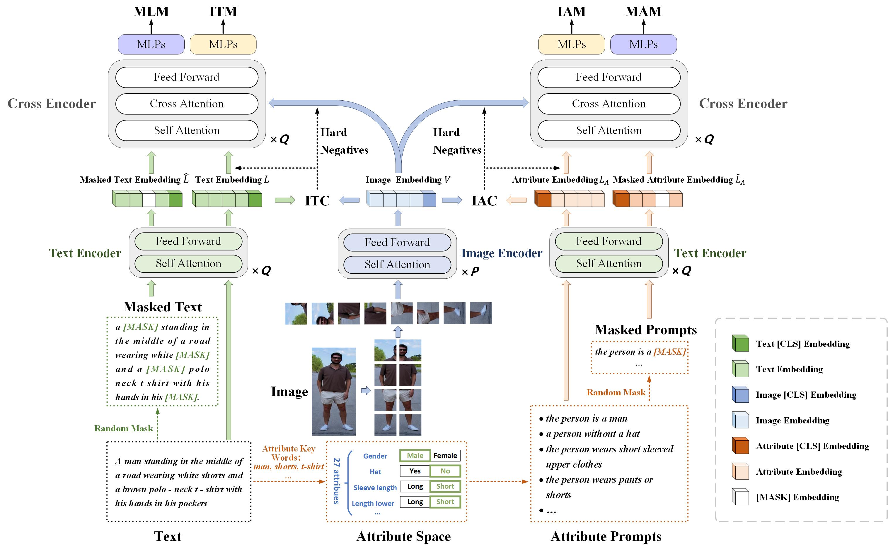
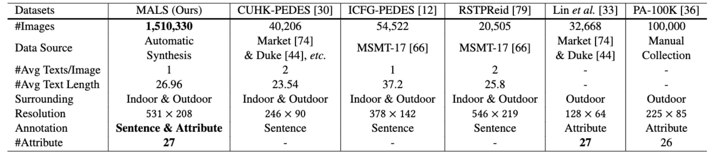
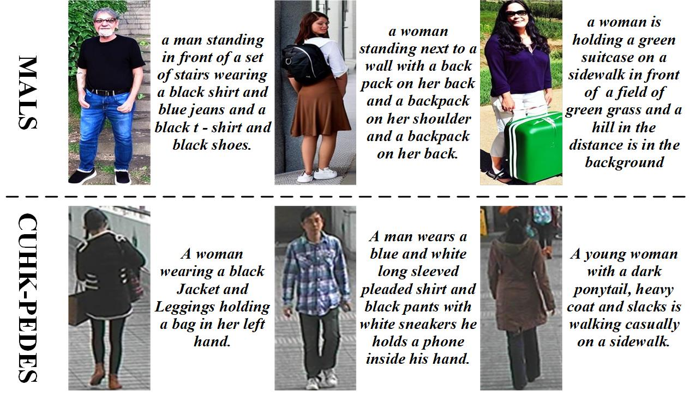

# APTM


**APTM** is a new joint **A**ttribute **P**rompt Learning and **T**ext **M**atching Learning framework, considering the shared knowledge between attribute and text. As the name implies, APTM contains an attribute prompt learning stream and a text matching learning stream.

We also present a large Multi-Attribute and Language Search dataset for text-based person retrieval, called **MALS**, and explore the feasibility of performing pre-training on both attribute recognition and image-text matching tasks in one stone. In particular, MALS contains 1, 510, 330 image-text pairs, which is about 37.5× larger than prevailing CUHK-PEDES, and all images are annotated with 27 attributes. 

Extensive experiments validate the effectiveness of the pre-training on MALS, achieving the state-of-the-art retrieval performance via APTM on three challenging real-world benchmarks. In particular, APTM achieves a consistent improvement of +6.60%, +7.39%, and +15.90% Recall@1 accuracy on CUHK-PEDES, ICFG-PEDES, and RSTPReid datasets by a clear margin, respectively. More details can be found at our paper: [Towards Unified Text-based Person Retrieval: A Large-scale Multi-Attribute and Language Search Benchmark](https://arxiv.org/abs/2306.02898)
<div align="center"></div>

## News
* The **APTM** is released. Welcome to communicate！

## MALS
MALS leverages generative models to generate a large-scale dataset including 1.5𝑀 image-text pairs. Each image-text pair in MALS is annotated with one corresponding description and several appropriate attribute labels, indicating that MALS is not only effective for text-image matching and attribute prompt learning, but also explores the feasibility of pre-training for both attribute recognition and image-text matching in one stone.The dataset is released at [Baidu Yun](https://pan.baidu.com/s/1HMvNIIFlquI2w0R6f0G7Dg) [4kq0]. 

**Note that MALS can only be used for research, any commercial usage is forbidden.**

This is the comparison between MALS and other text based person retrieval datasets. 
<div align="center"></div>
These are examples of our MALS dataset and CUHK-PEDES.
<div align="center"></div>
Annotation format:

```
[{"image": "gene_crop/c_g_a_0/0.jpg",
"caption": "a young boy wearing a black hoodie leaning against a wall with his hands on his hips and his hands on his hips wearing jeans and a baseball cap",
"image_id": "c_g_a_0_0",
"label": [1, 0, ..., 1, 1]},
...
{"image": "gene_crop/c_g_a_0/20217.jpg",
"caption": "a woman in a white top and black pants posing for a picture in front of a brick wall with a pink carpet in front of her",
"image_id": "c_g_a_0_20217",
"label": [0, 1, ..., -1, -1]}]
```

## Models and Weights

The checkpoints have been released at [Baidu Yun](https://pan.baidu.com/s/1oAkenOKaVEYWpNh2hznkGA) [b2l8] and [Google Drive](https://drive.google.com/drive/folders/1N1Lumvb4epP0awHLcJ3RzQmv5zwrAFBh?usp=sharing)


## Usage

### Install Requirements

we use 4 A100 80G GPU for training and evaluation.

Create conda environment.

```
conda create -n aptm python=3.8
conda activate aptm
pip install torch==1.9.1+cu111 torchvision==0.10.1+cu111 torchaudio==0.9.1 -f https://download.pytorch.org/whl/torch_stable.html
pip3 install -r requirements.txt
```

### Datasets Prepare

Download the CUHK-PEDES dataset from [here](https://github.com/ShuangLI59/Person-Search-with-Natural-Language-Description) , the PA-100K dataset from [here](https://github.com/xh-liu/HydraPlus-Net), the RSTPReid dataset from [here](https://github.com/NjtechCVLab/RSTPReid-Dataset), and ICFG-PEDES dataset from [here](https://github.com/zifyloo/SSAN). Download the processed json files of the aboves four datasets from [here](https://pan.baidu.com/s/1oAkenOKaVEYWpNh2hznkGA) [b2l8]

Download pre-trained models for parameter initialization:

image encoder: [swin-transformer-base](https://github.com/SwinTransformer/storage/releases/download/v1.0.0/swin_base_patch4_window7_224_22k.pth)

text encoder: [bert-base](https://huggingface.co/bert-base-uncased/tree/main)

Organize `data` folder as follows:

```
|-- data/
|    |-- bert-base-uncased/
|    |-- finetune/
|        |-- gene_attrs/
|            |-- g_4x_attrs.json
|            |-- g_c_g_a_0_attrs.json
|            |-- ...
|        |-- cuhk_train.json
|        |-- ...
|        |-- icfg_train.json
|        |-- ...
|        |-- rstp_train.json
|        |-- ...
|        |-- PA100K_train.json
|        |-- ...
|    |-- swin_base_patch4_window7_224_22k.pth
```

And organize those datasets in `images` folder as follows:

```
|-- images/
|    |-- <CUHK-PEDES>/
|        |-- imgs/
|            |-- cam_a/
|            |-- cam_b/
|            |-- ...
|            |-- train_query/
|            |-- gene_crop/
|                |-- 4x/
|                |-- c_g_a/
|                |-- ...
|                |-- i_g_a_43/
|
|    |-- <ICFG-PEDES>/
|        |-- test/
|        |-- train/
|
|    |-- <pa100k>/
|        |-- release_data/
|
|    |-- <RSTPReid>/
```

### Pretraining
We pretrain our APTM using MALS as follows：

```
python3 run.py --task "itr_gene" --dist "f4" --output_dir "output/pretrained"
```

### Fine-tuning
We fine-tune our APTM using existing text-based Person Reid datasets. Performance can be improved by replacing the backbone with our pre-trained model. Taking CUHK-PEDES as example:

```
python3 run.py --task "itr_cuhk" --dist "f4" --output_dir "output/ft_cuhk" --checkpoint "output/pretrained/checkpoint_31.pth"
```

### Evaluation

```
python3 run.py --task "itr_cuhk" --evaluate --dist "f4" --output_dir "output/ft_cuhk/test" --checkpoint "output/ft_cuhk/checkpoint_best.pth"
```

## Reference
If you use APTM in your research, please cite it by the following BibTeX entry:

```
@article{yang2023towards,
  title={Towards Unified Text-based Person Retrieval: A Large-scale Multi-Attribute and Language Search Benchmark},
  author={Yang, Shuyu and Zhou, Yinan and Wang, Yaxiong and Wu, Yujiao and Zhu, Li and Zheng, Zhedong},
  journal={arXiv preprint arXiv:2306.02898},
  year={2023}
}

```
