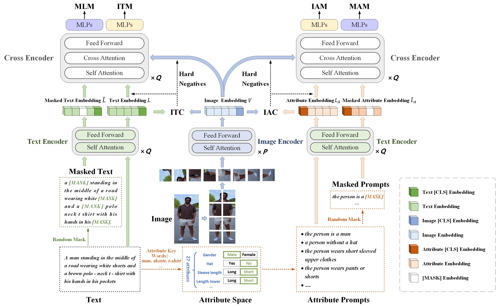
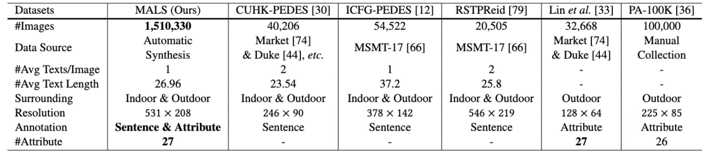
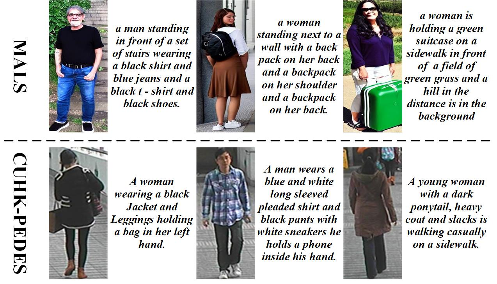

# APTM

	
[](https://paperswithcode.com/sota/nlp-based-person-retrival-on-cuhk-pedes?p=towards-unified-text-based-person-retrieval-a)
[](https://paperswithcode.com/sota/text-based-person-retrieval-on-icfg-pedes?p=towards-unified-text-based-person-retrieval-a)
[](https://paperswithcode.com/sota/text-based-person-retrieval-on-rstpreid-1?p=towards-unified-text-based-person-retrieval-a)

**APTM (ACM MM 2023)** is a new joint **A**ttribute **P**rompt Learning and **T**ext **M**atching Learning framework, considering the shared knowledge between attribute and text. As the name implies, APTM contains an attribute prompt learning stream and a text matching learning stream.

We also present a large Multi-Attribute and Language Search dataset for text-based person retrieval, called **MALS**, and explore the feasibility of performing pre-training on both attribute recognition and image-text matching tasks in one stone. In particular, MALS contains 1,510,330 image-text pairs, which is approximately 37.5 times larger than the prevailing CUHK-PEDES, and all images are annotated with 27 attributes. 

Extensive experiments validate the effectiveness of the pre-training on MALS, achieving the state-of-the-art retrieval performance via APTM on three challenging real-world benchmarks. In particular, APTM achieves a consistent improvement of +6.60%, +7.39%, and +15.90% Recall@1 accuracy on the CUHK-PEDES, ICFG-PEDES, and RSTPReid datasets, respectively, by a clear margin. More details can be found at our paper: [Towards Unified Text-based Person Retrieval: A Large-scale Multi-Attribute and Language Search Benchmark](https://arxiv.org/abs/2306.02898)
<div align="center"></div>

## News
* The **OneDrive** link of **MALS** dataset are released！
* The **APTM** and the **MALS** dataset are released. Welcome to communicate！

## MALS
MALS leverages generative models to generate a large-scale dataset including 1.5𝑀 image-text pairs. Each image-text pair in MALS is annotated with one corresponding description and several appropriate attribute labels, indicating that MALS is not only effective for text-image matching and attribute prompt learning, but also explores the feasibility of pre-training for both attribute recognition and image-text matching in one stone. **The dataset is released at [Baidu Yun](https://pan.baidu.com/s/1HMvNIIFlquI2w0R6f0G7Dg) [4kq0] and [OneDrive](https://1drv.ms/f/s!Ak2z-VJ5LcCvgdZGSTJbaHOMMFZi9A?e=gCBnv0) [mals].**

**Note that MALS can only be used for research; any commercial usage is forbidden.**

This is the comparison between MALS and other text-based person retrieval datasets. 
<div align="center"></div>
These are examples of our MALS dataset and CUHK-PEDES.
<div align="center"></div>
Annotation format:

```
[{"image": "gene_crop/c_g_a_0/0.jpg",
"caption": "a young boy wearing a black hoodie leaning against a wall with his hands on his hips and his hands on his hips wearing jeans and a baseball cap",
"image_id": "c_g_a_0_0",
"label": [1, 0, ..., 1, 1]},
...
{"image": "gene_crop/c_g_a_0/20217.jpg",
"caption": "a woman in a white top and black pants posing for a picture in front of a brick wall with a pink carpet in front of her",
"image_id": "c_g_a_0_20217",
"label": [0, 1, ..., -1, -1]}]
```

## Models and Weights

The checkpoints have been released at [Baidu Yun](https://pan.baidu.com/s/1oAkenOKaVEYWpNh2hznkGA) [b2l8] and [Google Drive](https://drive.google.com/drive/folders/1N1Lumvb4epP0awHLcJ3RzQmv5zwrAFBh?usp=sharing)


## Usage

### Install Requirements

We use 4 A100 80G GPUs for training and evaluation.

Create conda environment.

```
conda create -n aptm python=3.8
conda activate aptm
pip install torch==1.9.1+cu111 torchvision==0.10.1+cu111 torchaudio==0.9.1 -f https://download.pytorch.org/whl/torch_stable.html
pip3 install -r requirements.txt
```

### Datasets Prepare

Download the CUHK-PEDES dataset from [here](https://github.com/ShuangLI59/Person-Search-with-Natural-Language-Description) , the PA-100K dataset from [here](https://github.com/xh-liu/HydraPlus-Net), the RSTPReid dataset from [here](https://github.com/NjtechCVLab/RSTPReid-Dataset), and ICFG-PEDES dataset from [here](https://github.com/zifyloo/SSAN). Download the processed JSON files of the above four datasets from [here](https://pan.baidu.com/s/1oAkenOKaVEYWpNh2hznkGA) [b2l8]

Download pre-trained models for parameter initialization:

image encoder: [swin-transformer-base](https://github.com/SwinTransformer/storage/releases/download/v1.0.0/swin_base_patch4_window7_224_22k.pth)

text encoder: [bert-base](https://huggingface.co/bert-base-uncased/tree/main)

Organize `data` folder as follows:

```
|-- data/
|    |-- swin_base_patch4_window7_224_22k.pth
|    |-- bert-base-uncased/
|    |-- gene_attrs/
|        |-- g_4x_attrs.json
|        |-- g_c_g_a_0_attrs.json
|        |-- ...
|    |-- finetune/
|        |-- cuhk_train.json
|        |-- ...
|        |-- icfg_train.json
|        |-- ...
|        |-- rstp_train.json
|        |-- ...
|        |-- PA100K_train.json
|        |-- ...
```

And organize those datasets in `images` folder as follows:

```
|-- images/
|    |-- <CUHK-PEDES>/
|        |-- imgs/
|            |-- cam_a/
|            |-- cam_b/
|            |-- ...
|            |-- train_query/
|    |-- <MALS>/
|        |-- gene_crop/
|        |-- 4x/
|        |-- c_g_a/
|        |-- ...
|        |-- i_g_a_43/
|
|    |-- <ICFG-PEDES>/
|        |-- test/
|        |-- train/
|
|    |-- <pa100k>/
|        |-- release_data/
|
|    |-- <RSTPReid>/
```

### Pretraining
We pretrain our APTM using MALS as follows：

```
python3 run.py --task "itr_gene" --dist "f4" --output_dir "output/pretrained"
```

### Fine-tuning
We fine-tune our APTM using existing text-based Person Reid datasets. Performance can be improved by replacing the backbone with our pre-trained model. Taking CUHK-PEDES as an example:

```
python3 run.py --task "itr_cuhk" --dist "f4" --output_dir "output/ft_cuhk" --checkpoint "output/pretrained/checkpoint_31.pth"
```

### Evaluation

```
python3 run.py --task "itr_cuhk" --evaluate --dist "f4" --output_dir "output/ft_cuhk/test" --checkpoint "output/ft_cuhk/checkpoint_best.pth"
```

## Reference
If you use APTM in your research, please cite it by the following BibTeX entry:

```bibtex
@inproceedings{yang2023towards,
  title={Towards Unified Text-based Person Retrieval: A Large-scale Multi-Attribute and Language Search Benchmark},
  author={Yang, Shuyu and Zhou, Yinan and Wang, Yaxiong and Wu, Yujiao and Zhu, Li and Zheng, Zhedong},
  booktitle = {Proceedings of the 2023 {ACM} on Multimedia Conference},
  year={2023}
}

```


## 🔗 Related Projects

<p align="center"><i>Explore our ecosystem for Object Re-Identification 🔍</i></p >

<div align="center">
  <table>
    <tr>
      <td align="center" colspan="3">
        <a href=" ">
          <h3>⛹️</h3>
          <b>Person re-ID Baseline (PyTorch)</b>
        </a >
        <br><sub>A <b>Tiny, Friendly & Strong</b> PyTorch Baseline for Person / Vehicle Re-ID<br>with Hands-on Tutorial · The Community Standard since 2017</sub>
        <br><br>
        <a href="https://github.com/layumi/Person_reID_baseline_pytorch">< img src="https://img.shields.io/github/stars/layumi/Person_reID_baseline_pytorch.svg?style=social&label=Star" alt="GitHub stars"></a >
      </td>
    </tr>
    <tr>
      <td align="center" width="33%">
        <a href="https://github.com/layumi/3D-Magic-Mirror">
          <h3>🪞</h3>
          <b>3D Magic Mirror</b>
        </a >
        <br><sub>Clothing Reconstruction from a Single Image<br>via a Causal Perspective · npj AI'26</sub>
        <br><br>
        <a href="https://github.com/layumi/3D-Magic-Mirror">< img src="https://img.shields.io/github/stars/layumi/3D-Magic-Mirror.svg?style=social&label=Star" alt="GitHub stars"></a >
      </td>
      <td align="center" width="33%">
        <a href="https://github.com/NVlabs/DG-Net">
          <h3>✨</h3>
          <b>DG-Net</b>
        </a >
        <br><sub>Joint Generation + Re-ID Learning<br>CVPR'19 Oral · NVIDIA</sub>
        <br><br>
        <a href="https://github.com/NVlabs/DG-Net">< img src="https://img.shields.io/github/stars/NVlabs/DG-Net.svg?style=social&label=Star" alt="GitHub stars"></a >
      </td>
      <td align="center" width="33%">
        <a href="https://github.com/layumi/Person-reID_GAN">
          <h3>🎨</h3>
          <b>Person re-ID GAN</b>
        </a >
        <br><sub>GAN-based Augmentation (LSRO)<br>ICCV'17</sub>
        <br><br>
        <a href="https://github.com/layumi/Person-reID_GAN">< img src="https://img.shields.io/github/stars/layumi/Person-reID_GAN.svg?style=social&label=Star" alt="GitHub stars"></a >
      </td>
    </tr>
    <tr>
      <td align="center" width="33%">
        <a href="https://github.com/layumi/Image-Text-Embedding">
          <h3>📝</h3>
          <b>Language Person Search</b>
        </a >
        <br><sub>Text-based Person Retrieval<br>Dual-Path Embedding</sub>
        <br><br>
        <a href="https://github.com/layumi/Image-Text-Embedding">< img src="https://img.shields.io/github/stars/layumi/Image-Text-Embedding.svg?style=social&label=Star" alt="GitHub stars"></a >
      </td>
      <td align="center" width="33%">
        <a href="https://github.com/Shuyu-XJTU/APTM">
          <h3>🏷️</h3>
          <b>APTM</b>
        </a >
        <br><sub>Attribute Prompt Learning &amp; Text Matching<br>MALS Benchmark (1.5M pairs) · ACM MM'23</sub>
        <br><br>
        <a href="https://github.com/Shuyu-XJTU/APTM">< img src="https://img.shields.io/github/stars/Shuyu-XJTU/APTM.svg?style=social&label=Star" alt="GitHub stars"></a >
      </td>
      <td align="center" width="33%">
        <a href="https://github.com/Shuyu-XJTU/CMP">
          <h3>🚨</h3>
          <b>CMP</b>
        </a >
        <br><sub>Text-based Person <b>Anomaly</b> Search<br>PAB Benchmark (1M pairs) · ICCV'25 <b>Highlight</b></sub>
        <br><br>
        <a href="https://github.com/Shuyu-XJTU/CMP">< img src="https://img.shields.io/github/stars/Shuyu-XJTU/CMP.svg?style=social&label=Star" alt="GitHub stars"></a >
      </td>
    </tr>
    <tr>
      <td align="center" width="33%">
        <a href="https://github.com/layumi/person-reid-3d">
          <h3>🧊</h3>
          <b>3D Person re-ID</b>
        </a >
        <br><sub>Parameter-Efficient Re-ID<br>in the 3D Space (OG-Net)</sub>
        <br><br>
        <a href="https://github.com/layumi/person-reid-3d">< img src="https://img.shields.io/github/stars/layumi/person-reid-3d.svg?style=social&label=Star" alt="GitHub stars"></a >
      </td>
      <td align="center" width="33%">
        <a href="https://github.com/layumi/Pedestrian_Alignment">
          <h3>🚶</h3>
          <b>Pedestrian Alignment</b>
        </a >
        <br><sub>Pedestrian Alignment Network (PAN)<br>for Robust Re-ID</sub>
        <br><br>
        <a href="https://github.com/layumi/Pedestrian_Alignment">< img src="https://img.shields.io/github/stars/layumi/Pedestrian_Alignment.svg?style=social&label=Star" alt="GitHub stars"></a >
      </td>
      <td align="center" width="33%">
        <a href="https://github.com/layumi/2016_person_re-ID">
          <h3>🔁</h3>
          <b>2-Stream Person re-ID</b>
        </a >
        <br><sub>Verification + Identification<br>Baseline</sub>
        <br><br>
        <a href="https://github.com/layumi/2016_person_re-ID">< img src="https://img.shields.io/github/stars/layumi/2016_person_re-ID.svg?style=social&label=Star" alt="GitHub stars"></a >
      </td>
    </tr>
  </table>
</div>

---

<p align="center">
  ⭐ If you find our projects helpful, a <b>star</b> is the best support! ⭐
</p >
